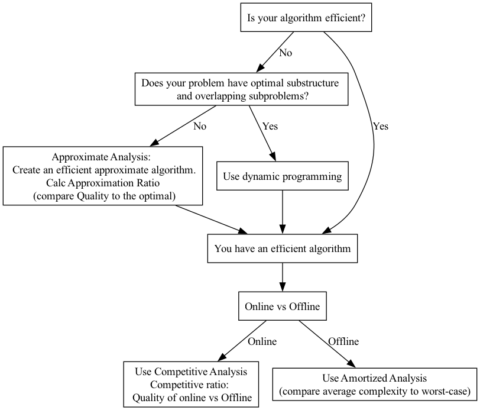

# Comparing Different Algorithm Analysis Types

In my CS6150 Advanced Algorithms class, I'm learning about different kinds of algorithm analysis.

I tried to understand how they all fit together.  Here's the result.

## Similarities between all 3:
- Approximate Analysis — compares how close the approximate algorithm gets to optimal (approximation ratio)
- Competitive Analysis — compares how close an online algorithm gets to the offline algorithm (competitve ratio)
- Amortized Analysis — compares the worst-case complexity of an algorithm to the average complexity.

## Similarities between Competitive and Amortized:
Both Competitive and Amortized deal with sequences of steps: Competitive because it doesn’t know the future and so it can only deal with one step at a time (such as a page request in memory paging); and Amortized because it analyzes the complexity of each step in an algorithm to determine the overall, or amortized, complexity.

## How they fit together:
- Is the optimal algorithm tractable (can it run in a reasonable time on a real computer / is it in P rather than NP)?
    - If not, then use approximation analysis to compare your approximate but realistic algorithm to the optimal.  The approximation ratio compares the quality of the worst-case approximate answer to the optimal algorithm’s answer.  Here, we also compare efficiency, ie the computational complexity of the optimal algorithm (usually in NP) to that of the approximate algorithm (certainly in P).
- You have a tractable algorithm (in P).
    - Is it online?  If yes, then use competitive analysis to compare its answer to that of the offline.  The competitive ratio compares the quality of the online algorithm’s answer to the quality of the offline algorithm.  We don’t usually worry about computational complexity here, because the fact that it’s online implies it’s a practical algorithm that we can use to solve real-world problems; in other words, it’s already an efficient algorithm.
    - It’s offline?  You might use amortized analysis to see whether the complexity is actually better than the worst-case complexity might suggest.  

### Diagram

## What does each type care about?

| Type | Quality (Ratio) | Efficiency (Computational Complexity) | 
| ---- | - | - |
| Approximate | Approximation Ratio of Approximate to Optimal | Assumes optimal is inefficient, approx much more |
| Competitive | Competitive Ratio of Online to Offline | Assumes offline algorithm is efficient and that online algorithm will also be efficient | 
| Amortized | Doesn't care, not comparing one algorithm to another | Cares about efficiency of various steps *within* the single algorithm | 

## Efficiency vs Quality

From ChatGPT:

In the context of an approximation algorithm, quality and efficiency are often balanced against each other:

### Quality:
Refers to how close the algorithm's solution is to the optimal solution.
Measured by the approximation ratio, which indicates the worst-case bound on how far the solution deviates from optimal. For example, a ratio of 2 means the solution is at most twice as bad as the optimal.
Higher quality often requires more complex algorithms or longer runtimes, especially if the approximation ratio is close to 1 (near-optimal).

### Efficiency:
Refers to how fast the algorithm runs and how much computational resources (e.g., time and space) it uses.
Efficient algorithms typically run in polynomial time, making them feasible for large inputs.
However, improving efficiency can sometimes reduce the solution quality, leading to higher approximation ratios.

### Trade-off in Approximation Algorithms:
**Better Quality**: Often means more sophisticated or time-consuming processes, potentially moving closer to the optimal solution but increasing computation time.
**Higher Efficiency**: Usually achieved by simplifying the algorithm's logic or using heuristics that run quickly but may result in a lower-quality solution.